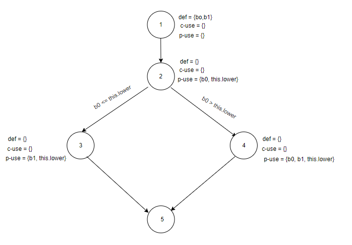

## Manual data-flow coverage calculations for Intersect method for Range Class
### Range.Intersect



#### Def-Use sets per statement
| | |
|:--:|:--:|
| defs: | def(1) = {b0, b1} |
| uses: | use(2) = {b0, this.lower} |
| | use(3) = {b1, this.lower} |
| | use(4) = {b0, b1, this.lower} |
| du-pairs: | for b0: (1, 2), (1, 4) |
| | for b1: (1, 3), (1, 4) |

#### DU-Pair per variable
| Variable | Def at node (n) | DCU (v, n) | DPU (v, n) |
|:--:|:--:|:--:|:--:|
| b0 | 1 | {} | {(2, 3), (2, 4)} |
| b1 | 1 | {} | {} |

Total
CU = 0
PU = 2

#### DU-Pair Coverage
| | |
|:--:|:--:|
| Test Case | DU-pairs covered |
| intersectsWithBLBAndLB | dpu {(2, 3)} |
| intersectsWithBLBAndALB | dpu {(2, 3)} |
| intersectsWithBLBAndAUB | dpu {(2, 3)} |
| intersectsWithLBAndALB | dpu {(2, 3)} |
| intersectsWithLBAndUB | dpu {(2, 3)} |
| intersectsWithNormalAndNormal | dpu {(2, 4)} |
| intersectsWithBUBAndUB | dpu {(2, 4)} |
| intersectsWithBUBAndAUB | dpu {(2, 4)} |
| intersectsWithUBAndAUB | dpu {(2, 4)} |
| intersectsWithInputAUBAndMAX | dpu {(2, 4)} |
| intersectsWithInputBLBAndMIN | dpu {(2, 3)} |
| intersectsWithInputNaNAnd1 | dpu {(2, 4)} |

## Testing strategy used
The testing strategy used this time since it is a white-box testing exercise was to look at the source code and carry out a statement coverage

For Range.combineIgnoringNaN the test cases are shown below

```
    @Test
    public void testCombineIgnoringNaN_bothRangesNull() {
        Range result = Range.combineIgnoringNaN(null, null);
        assertNull(result);
    }

    @Test
    public void testCombineIgnoringNaN_range1Null() {
        Range range2 = new Range(1.0, 5.0);
        Range result = Range.combineIgnoringNaN(null, range2);
        assertEquals(range2, result);
    }

    @Test
    public void testCombineIgnoringNaN_range2Null() {
        Range range1 = new Range(1.0, 5.0);
        Range result = Range.combineIgnoringNaN(range1, null);
        assertEquals(range1, result);
    }

    @Test
    public void testCombineIgnoringNaN_bothRangesNotNull() {
        Range range1 = new Range(1.0, 5.0);
        Range range2 = new Range(3.0, 7.0);
        Range result = Range.combineIgnoringNaN(range1, range2);
        assertEquals(new Range(1.0, 7.0), result);
    }

    @Test
    public void testCombineIgnoringNaN_range1NaN() {
        Range range1 = new Range(Double.NaN, 5.0);
        Range range2 = new Range(3.0, 7.0);
        Range result = Range.combineIgnoringNaN(range1, range2);
        assertEquals(range2, result);
    }

    @Test
    public void testCombineIgnoringNaN_range2NaN() {
        Range range1 = new Range(1.0, 5.0);
        Range range2 = new Range(Double.NaN, 7.0);
        Range result = Range.combineIgnoringNaN(range1, range2);
        assertEquals(range1, result);
    }

    @Test
    public void testCombineIgnoringNaN_bothRangesNaN() {
        Range range1 = new Range(Double.NaN, 5.0);
        Range range2 = new Range(Double.NaN, 7.0);
        Range result = Range.combineIgnoringNaN(range1, range2);
        assertNull(result);
    }
    
    @Test
    public void testCombineIgnoringNaN_bothRangesNa() {
        Range range1 = new Range(Double.NaN, Double.NaN);
        Range range2 = new Range(Double.NaN, Double.NaN);
        Range result = Range.combineIgnoringNaN(range1, range2);
        assertNull(result);
    }
    
    @Test
    public void testCombineIgnoringNaN_Range1Null() {
        Range range1 = null;
        Range range2 = new Range(Double.NaN, Double.NaN);
        Range result = Range.combineIgnoringNaN(range1, range2);
        assertNull(result);
    }
    
    @Test
    public void testCombineIgnoringNaN_Range2Null() {
        Range range1 = new Range(Double.NaN, Double.NaN);
        Range range2 = null;
        Range result = Range.combineIgnoringNaN(range1, range2);
        assertNull(result);
    }
```
